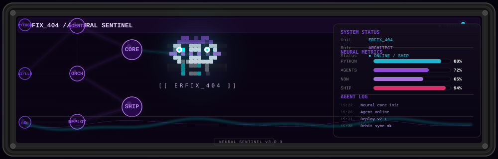

<div align="center">



<br/>
<br/>

```ascii
┌─────────────────────────────────────────────────────────────┐
│  ERFIX_404 — Autonomous Architect                           │
│  PY · AI · n8n · Vibe Code                                   │
├─────────────────────────────────────────────────────────────┤
│  🔭 building: autonomous agents, AI pipelines, web apps      │
│  🌐 open source: github.com/Erfix404                         │
│  💬 ask me: python, ai agents, n8n workflows                 │
└─────────────────────────────────────────────────────────────┘
```

</div>

---

### 🛠 Stack

`python` `javascript` `ai agents` `n8n` `react` `node` `docker`

### 📊 GitHub Stats

<div align="center">

[](https://github.com/Erfix404)
[](https://github.com/Erfix404)

</div>

---

<div align="center">

[](https://wakatime.com/@Erfix404)
[](https://github.com/Erfix404)

```
> system: online — v3.0.0
> status: shipping
> mood:   👾
```

</div>
